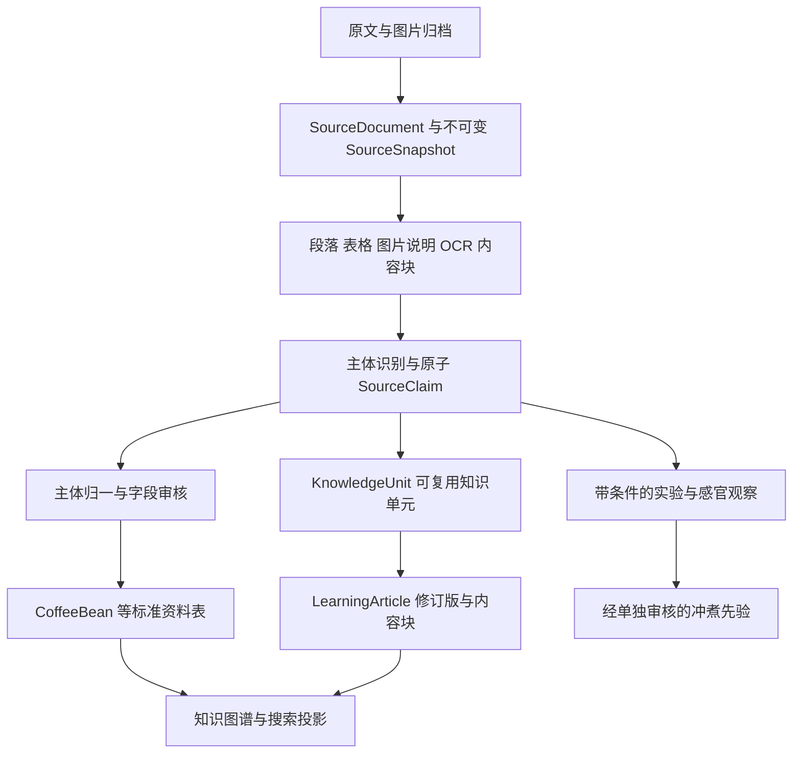

# 有容乃大文章精细提取与知识库数据库方案

设计日期：2026 年 10 月 2 日。状态：待实施设计。本文件定义字段、证据、内容模型、入库流程和验收口径；不表示已迁移数据库或已完成全量提取。

建议在现有 Prisma 和 PostgreSQL 架构上增量建设。**咖啡豆继续作为资料层中心，知识单元作为知识内容层中心；原文、提取事实、编辑内容、业务字段分别保存，通过版本固定的证据连接。** 这样既能尽量利用每篇文章的信息，也能回答“这句话从哪里来、适用于什么条件、为什么写进这个字段”。

## 现状与处理范围

本方案依据当前工作区的 `schema.prisma`、学院读模型、知识文章质量标准、清洗政策 V2 和恢复后的文章归档制定。文中的新模型名称均为建议，不是已存在的表。

| 已有资产 | 本次确认的状态 | 设计影响 |
| --- | --- | --- |
| 文章目录 | 已知 1,270 篇 | 这是当前已知集合，不等于公众号历史全集已核齐 |
| 正文恢复 | 1,257 篇 `body_recovered`；7 篇缺失；3 篇缓存无效；3 篇图片消息不完整 | `body_recovered` 只表示提取出正文，不能转换为“完整原文已核验” |
| 图片 | 3,947 个图片 URL 对应文件已保存，关联出现 7,795 次 | 保留文件去重与出现位置两套身份；未做 OCR 的图片仍有信息缺口 |
| 嵌入媒体 | 49 篇有待处理的音视频等内容 | 文字可先入候选层；依赖媒体的结论不能宣称已核实 |
| 最新目录覆盖 | 尚未核齐 | 全量验收分“已知目录处理完”和“来源目录覆盖核齐”两个指标 |
| 资料与证据 | 已有 `SourceDocument`、`SourceSnapshot`、`SourceExtractionRun`、`SourceClaim` | 扩展既有链路，避免新建第二套事实系统 |
| 知识内容 | 已有 `LearningArticle`，主要字段为标题、正文、分类、豆子 ID 数组 | 需要补充知识单元、内容块、版本、引用、适用条件、学习目标和发布流程 |
| 前端内容 | 当前学院读取已含源码编辑版本优先逻辑 | 数据库中的旧短稿不能覆盖已经修订的长文；迁移必须保留现有版本优先关系 |

归档统计来自 `apps/web/output/data/yourong/original_archive_2026-10-01/manifest.json` 和 `verification.json`。旧 `article_index_v2` 的正文状态和早期清洗的“可入库”数量不能直接作为本轮验收结果。

处理单位从“文章”细化到“内容块”。所有文章均扫描：一篇豆单可以同时产出批次资料、处理法知识、价格记录、作者评价和订阅规则；一篇产区游记可以同时产出地理资料、人物关系、当地观察和知识文章素材。文章采用多标签分类，不能只处理旧索引中被单独归为知识文章的部分。

## 信息从原文进入数据库的路径

有四种不同的“一条记录”：原文说了什么是 `SourceClaim`；我们采用哪个字段值是 `CanonicalFieldDecision`；用户可以学习什么是 `KnowledgeUnit`；用户最终读到的内容是 `LearningArticleRevision`。它们不能互相替代。

### 提取粒度

| 层级 | 最小单元 | 保存内容 |
| --- | --- | --- |
| 文档 | 一篇来源文章 | 来源、标题、作者、发布时间、原文获取与完整度 |
| 快照 | 某次不可变文本及资产版本 | 正文、原始 HTML 哈希、正文哈希、解析版本、采集时间 |
| 内容块 | 一个段落、列表项、表格单元格或媒体出现位置 | 原始顺序、层级、标题路径、主体范围、提取处置状态 |
| 主体 | 一只豆、一个测试组、一个庄园或一个概念的局部提及 | 原文名称、所属片段、候选标准实体、身份审核 |
| 事实 | 一个主体的一个谓词、值和完整限定条件 | 数值与单位、时间、范围、否定、说话者和证据 |
| 知识单元 | 能独立理解并复用的一条定义、方法或有条件结论 | 解释、条件、例外、证据、适用对象、学习目标 |
| 发布内容 | 一个经审核的完整内容版本 | 章节、卡片、图表、术语、引用、站内关联及 SEO |

原子化不能丢失上下文。例如“15 格更舒服”必须保留磨豆机、豆子、测试日期、注水方式和品尝温度；正文标题中的共用条件可以继承，但继承关系及其证据也要保存。两个不同测试段的条件禁止交叉继承。

## 字段填写的共同规则

### 值与缺失原因

资料表保留现有明确类型；不把所有字段改成万能 EAV 表。候选事实允许使用有 JSON Schema 的 `valueJson`，通过注册的谓词映射写入标准字段。

| 值类型 | 建议结构 | 规则 |
| --- | --- | --- |
| 数值 | `value/min/max/unit/rawValue/qualifier/precision` | 精确、约数、区间、上下限分别保存；金额使用 Decimal |
| 日期 | `start/end/precision/rawValue/dateRole` | 区分采收、烘焙、测试、发货、发表；不把月份补成月初实测日期 |
| 枚举 | `normalizedCode/rawValue/normalizationRule` | 原词保留；精确别名可归一，模糊翻译待审核 |
| 实体 | `candidateId/canonicalId/linkStatus` | 不确定身份时留在候选层；禁止创建假庄园或假品种凑齐必填字段 |
| 描述 | 原文值与规范展示值分别保存 | 摘要和改写标明派生，不能冒充原文 |
| 派生值 | `formula/inputClaimIds/result/unit` | 如 16 g 粉与 256 g 水计算为 1:16；派生结果不伪装成原文直接断言 |

每个候选字段配 `valueStatus`：`present`、`not_stated`、`ambiguous`、`conflicting`、`unreadable`、`not_applicable`。其中 `not_stated` 仅表示在指定已处理范围未找到，不代表客观不存在。来源不完整时还需保留 `coverageStatus`，不能把未取得的内容判为没写。SQL `NULL` 不等于零、否定或默认值；JSON 缺少键与显式空值也应有确定含义。

### 断言类别与可信度

`assertionKind` 至少包含 `reported_fact`、`definition`、`observation`、`recommendation`、`hypothesis`、`causal_claim`、`marketing`。另存 `attribution`、`modality`、`polarity`、`scope`。

- 原文明确说过，并不代表事实已经被独立验证。区分“证据确实支持这种转述”与“该命题真实可靠”。
- `extractionConfidence`、`entityLinkConfidence`、`evidenceQuality`、`reviewStatus` 分开。置信分数没有校准前，不称为正确概率，也不以一个总分自动越过审核。
- 原作者的猜测、偏好和商业评价保留归属。来源数量还须按来源依赖关系去重；同一作者多篇重复、转载同一段不算独立验证。
- “没感觉到纸浆味”要保存为某位观察者在某个样本中的否定观察，不能删除，也不能直接否定另一位观察者。

## 来源与证据需要补充的结构

复用既有四张来源表，并新增少量子表。以下字段除明确写“已有”外均是建议扩展。

| 表及状态 | 关键字段 | 用途与约束 |
| --- | --- | --- |
| `SourceDocument` 扩展 | `sourceNamespace`、`publisher`、`authorText`、`language`、`publishedAt`、`updatedAtSource`、`canonicalUrl`、`currentSnapshotId`、`rightsStatus` | 作者不要求创建 `User`。未来外部 ID 唯一性按来源命名空间限定；现有 ID 不改写 |
| `SourceSnapshot` 扩展 | `parserVersion`、`textNormalizationVersion`、`bodyStatus`、`mediaStatus`、`coverageStatus`、`fullOriginalVerified` | 版本信息必须落到快照；现有文档级 parserVersion 不足以解释旧快照 |
| `SourceBlock` 新增 | `snapshotId`、`parentBlockId`、`ordinal`、`kind`、`headingPath`、`start`、`end`、`textLayerId`、`disposition`、`dispositionReason` | 多级标题、表格行列、图片说明可复原；每块都有处置结果 |
| `SourceAssetOccurrence` 新增 | `snapshotId`、`blockId`、`mediaAssetId`、`sourceUrl`、`ordinal`、`caption`、`altText`、`role`、`downloadStatus` | 同图在不同文章、不同位置出现分别关联；文件由 SHA256 去重 |
| `SourceTextLayer` 新增 | `snapshotId`、`assetOccurrenceId`、`kind`、`text`、`textHash`、`engineVersion`、`language`、`reviewStatus` | OCR、转写与原正文分层；不能将 OCR 静默拼进已固定哈希的正文 |
| `SourceSubject` 新增 | `snapshotId`、`parentSubjectId`、`localKey`、`subjectType`、`rawName`、`start`、`end`、`resolutionStatus` | 单篇多豆、多实验范围隔离；候选身份尚未确定也可收集事实 |
| `SourceClaim` 扩展 | `sourceSubjectId`、`assertionKind`、`valueStatus`、`qualifiers`、`attribution`、`modality`、`polarity`、`evidenceQuality`、`supersedesClaimId` | 复用已有 predicate、valueJson、reviewStatus；禁止再建一套平行事实表 |
| `SourceClaimEvidence` 新增 | `claimId`、`snapshotId`、`textLayerId`、`blockId`、`assetOccurrenceId`、`start`、`end`、`quote`、`bbox`、`timeStartMs`、`timeEndMs`、`role` | 一个事实可有主句、条件、表头、例外等多条锚点；媒体定位与文字定位分别校验 |
| `CanonicalFieldDecision` 新增 | `targetType`、受约束目标外键、`fieldPath`、`scopeKey`、`value`、`previousValue`、`expectedVersion`、`decision`、`reason`、`reviewer`、`ruleVersion`、`appliedAt` | 审核通过后才执行写入；保留采用及未采用原因，支持撤回 |
| `CanonicalFieldDecisionClaim` 新增 | `decisionId`、`claimId`、`role` | 决策与事实的多对多关系；role 为支持、反证或限定条件，均有外键 |

`SourceRecord` 保留采集记录及当前检索字段；它的冗余展示值不升级为第二个资料权威源。子豆记录可以保留现有父子关系，`SourceSubject` 负责更细的文本作用域，两者通过已验证映射关联。

### 证据定位合同

1. 新事实必须绑定不可变 `SourceSnapshot`。现有 `sourceSnapshotId` 可空，仅为历史兼容；无法可靠对齐旧快照的记录标记 `legacy_unanchored`，禁止直接提升到新标准字段。
2. 正文坐标使用 Unicode 码点和半开区间 `[start,end)`，数据库中记录 `offsetUnit=unicode_code_point`。校验 `snapshot.bodyText[start:end] == quote`；JavaScript 必须通过 `Array.from(text)` 等显式转换，不能直接把 UTF-16 索引混用。
3. 原始 HTML 原样存储，正文按指定解析版本提取；去零宽字符、繁简转换和空白清理只生成新的搜索层或快照，不改写旧证据依据。
4. OCR 坐标相对于固定 SHA 的图片，保存归一化矩形与图片尺寸；时间戳相对于固定媒体版本。OCR 置信度不是事实置信度；模糊数字或单位须人工核对。
5. 同一事实可以引用多个不连续片段；继承条件必须有独立 `role=context` 证据。主张、条件、例外任一发生变化，应生成新断言版本。
6. 图片缺失或视频未保存不阻止明确的正文事实进入候选层；依赖缺失媒体的结论维持待核验。不得把图表趋势凭文字描述还原成伪造测量值。

## 咖啡资料字段字典

字段组中逗号分隔的名称代表不同字段，不是一个字符串。除已有模型注明的必填外，新资料字段默认可空；“可提取”不等于当前文章一定提供。所有用于正式展示的资料值均须能回溯字段决策和证据。

### 产地与生产主体

| 归属 | 建议字段 | 类型或单位与写入规则 |
| --- | --- | --- |
| `Country` | `name`、`nativeName`、`isoCode`、`description` | 保留已有 name/slug/sourceKey；国家命名使用受控表 |
| `Region` | `parentRegionId`、`regionKind`、`adminLevel`、`nameLocal`、`aliases` | 支持行政区与咖啡产区差异；父节点同国家、不得成环；别名需范围限定 |
| `Region` | `latitude`、`longitude`、`boundaryRef`、`locationPrecision` | 地点坐标不能冒充区域边界；地址推算单列 `inferred` |
| 区域环境观测 | `altitudeMinM`、`altitudeMaxM`、`rainfallMm`、`temperatureMinC`、`temperatureMaxC`、`soilType`、`seasonPattern`、`observationPeriod`、`spatialScope` | 建议 `OriginEnvironmentObservation`，按观测时间和范围多行保存，避免全国平均值覆盖庄园实测 |
| `Estate` | `nameLocal`、`aliases`、`estateType`、`areaHa`、`coffeeAreaHa`、`foundedYear`、`locationPrecision` | 现有 farmSize/elevation 文本先保留，规范值通过审核补充；总面积与种植面积分开 |
| 生产组织 | `displayName`、`localName`、`organizationType`、`contactPublicUrl` | 二阶段新增 `ProducerOrganization`；农场、合作社、出口商、处理站、品牌角色不能互相替代 |
| 组织关系 | `organizationId`、`estateId` 或其他明确目标、`role`、`validFrom`、`validTo` | 建议 `ProductionRole`；所有权、管理、供货、加工是不同关系，附证据 |
| 田块与批次 | `plotName`、`lotCode`、`harvestYear`、`harvestStart`、`harvestEnd`、`harvestPrecision`、`productionKg`、`grade`、`screenSize`、`certificationText` | 田块不自动等于物理批次；“金标”先保存来源分级，不擅自变认证 |
| 批次测量 | `moisturePct`、`waterActivity`、`densityValue`、`densityUnit`、`measuredAt`、`measurementMethod` | 建议 `LotMeasurement`；没有单位、方法或明确归属时维持候选 |

当前 `Lot.estateId` 必填，且 `Estate.regionId` 必填。因此来源只有处理站、合作社或产区时，第一阶段留在来源候选层；不要制造“未知庄园”来满足约束。二阶段才引入独立生产单位模型，并通过专门迁移明确 Lot 如何关联庄园或处理站。区域环境历史与测量历史也在二阶段建表，第一阶段完整保存在有类型的事实中。

### 豆子与商品身份

| 归属 | 建议字段 | 类型或单位与写入规则 |
| --- | --- | --- |
| `CoffeeBean` | 现有名称、countryId、regionId、estateId、lotId、varietyId、processMethodId、roastLevel | 主资料写入必须满足现有四个必填引用及产地链一致性 |
| `CoffeeBeanVariety` | `varietyId`、`isPrimary`、`percentage`、`percentageBasis` | 混合比例 Decimal，可空；“含两品种”不能自动填各 50% |
| `Variety` | `species`、`lineageSummary`、`selectionHistory`、`originLocation` | 谱系关系通过事实和审核表达；商品名、地方俗称、遗传品种分开 |
| `VarietyAlias` | `language`、`scopeCountryId`、`aliasKind`、`reviewStatus` | 现有 alias 全局唯一；真正有歧义时需迁移为带作用域的别名，而不是强制归并 |
| 商品呈现 | `offerName`、`seller`、`sourceSubjectId`、`coffeeBeanId?`、`sku?`、`offerType` | 建议 `CoffeeOffer`；某品牌某次销售与长期豆子档案区分 |
| 商品观测 | `priceAmount`、`currency`、`basisMassG`、`packMassG`、`stockStatus`、`observedAt`、`validFrom`、`validTo` | 建议 `CoffeeOfferObservation`；“317.5 元/100 g”是计价基准，不等于每个 16 g 订阅包售价 |
| 组合豆单 | `collectionName`、`issueNumber`、`itemOrdinal`、`sampleMassG`、`sampleCount`、`expectedShipDate`、`shipDatePrecision` | 建议 `SourceCollection`、`SourceCollectionItem`；不是自动替用户创建社区 CoffeeList |
| 烘焙批次 | `roastedAt`、`datePrecision`、`roaster`、`roastDescription`、`roastMeasurement`、`recommendedRestDaysMin/Max` | 建议 `RoastBatch`；烘焙深浅、测量值和养豆建议分别有依据 |

一篇重复出现同一豆子，不代表新增标准豆；同庄园、同品种，也不足以判定是同一批次。以现有 cleaning V2 的身份边界为准。特别是 Gesha 1931 不因包含 Gesha 字样而自动合并，Mima 与 Altieri 的称呼也不能仅凭文本相邻就确认法律或经营主体相同。

### 处理过程

`ProcessMethod` 保留受控主分类；详细过程建议使用 `ProcessProtocol` 和顺序化 `ProcessStep`，主分类与步骤通过同一组事实校验。第一阶段可存入有版本 Schema 的事实载荷，二阶段再建业务表。

| 对象 | 字段 | 保留的细节 |
| --- | --- | --- |
| `ProcessProtocol` | `nameRaw`、`baseMethodId`、`subjectId`、`protocolVersion` | 完整名称与洗式、日晒、蜜处理等基础分类共存 |
| `ProcessStep` | `sequence`、`stage`、`inputState`、`action`、`outputState` | 采摘、分选、去皮、发酵、清洗、干燥、静置等阶段 |
| 发酵条件 | `oxygenCondition`、`vessel`、`medium`、`inoculant`、`additive`、`durationMin/MaxH`、`temperatureMin/MaxC`、`pHStart/End` | 厌氧不等于添加菌种；没有写温度则不能补“低温” |
| 干燥条件 | `dryingSurface`、`shadeLevel`、`durationDays`、`temperatureC`、`targetMoisturePct` | 缓慢、低温、冷蒸发分别保留原词，不凭名称推算时长 |
| 可控性 | `measurementStatus`、`operatorClaim`、`exceptions` | 区分实测、生产者描述和编辑解释 |

## 风味与冲煮信息

感官和实验信息应当成为独立的观察记录，再按审核策略汇总到豆子风味。这样才能保留一只豆在不同条件下的差异。

| 建议表 | 核心字段 | 入库边界 |
| --- | --- | --- |
| `SensoryObservation` | `subjectId`、`coffeeBeanId?`、`experimentArmId?`、`observerText`、`observedAt`、`method`、`sampleStage`、`servingTemperature`、`roastBatchId?`、`sourceClaimId` | 杯测、冲煮感受、包装风味、销售文案分别标识 evidenceKind |
| `SensoryDescriptor` | `observationId`、`flavorTagId?`、`rawDescriptor`、`dimension`、`intensity`、`scaleMin/Max`、`polarity`、`pleasantness`、`aftertasteDuration` | 花香、甜度、口感、余韵和愉悦度不同维度；未标量表的“明显”不转成 8 分 |
| `SourceExperiment` | `question`、`date`、`designType`、`independentVariables`、`controlledConditions`、`confounders`、`authorConclusion` | 文章里的实验不是用户亲自执行的 BrewSession |
| `SourceExperimentArm` | `experimentId`、`sequence`、`beanSubjectId`、`recipeId`、`changedVariables`、`replicateCount`、`deviations` | 原文“又试了几次”保留次数未知，不捏造 n |
| `ReferenceBrewRecipe` | `method`、`doseG`、`waterG`、`ratio`、`waterTemperatureC`、`grinderModel`、`grindSettingRaw`、`zeroReference`、`dripperModel`、`dripperSize`、`material`、`filter` | 不同磨豆机刻度不可直接比较；设定温度与实际温度分开 |
| `ReferenceBrewStep` | `sequence`、`action`、`startSec`、`endSec`、`waterG`、`cumulativeWaterG`、`pourPosition`、`agitation`、`waitSec`、`cutoffSec` | 累计水量与本段加水量不可混用；截流时间与自然流完时间分开 |
| 水质条件 | `waterSource`、`tdsValue`、`tdsUnit`、`instrument`、`conversionFactor`、`measurementTemperatureC`、`hardness`、`alkalinity`、`pH`、`mineralComposition` | 保存为有 Schema 的 recipe context，重复使用后再拆 WaterProfile；缺少模式的 TDS 数值不可视为可直接比较 |
| `ExperimentOutcome` | `armId`、`metric`、`value`、`unit`、`sampleWindowStart/EndSec`、`temperatureStage`、`attribution`、`interpretation` | 液体取样时间段与整杯结果分别表达；作者解释与测量值分开 |

现有 `CoffeeBeanFlavor.weight` 的默认 0.5 不能解释为实测强度。建议明确它是聚合权重，新增来源观察的关联；相同标签多次出现只提升证据覆盖，不自动累加风味强度。未通过审核的感官候选不能直接进入现有公开风味过滤条件。

`BeanIdentity` 接受审核后的身份和物理特征；`BeanPrior`、`BrewPrior` 只接受经过适用性检查的资料或编辑决策。一篇文章中的 91°C、15 格不能成为所有豆子的推荐。进入先验前必须有目标设备、目标豆类、适用范围、反例、审核人和先验版本；`BrewEngineRun` 固定使用的决策与先验版本。禁止由文章内容伪造 `BrewExecutionTrace`、`BrewAttemptV2` 或真实执行反馈。

## 知识库内容模型

知识图谱解决实体之间有什么关系；知识库还需要让人能够阅读、理解、比较和练习。应补上以下内容层，继续服务 `/learn` 及现有资料页面，不另开孤立的内容系统。

### 主题与可复用知识单元

| 建议表 | 字段 | 定义 |
| --- | --- | --- |
| `KnowledgeTopic` | `id`、`slug`、`name`、`summary`、`parentId`、`displayOrder`、`status` | 主题目录，例：冲煮 → 研磨 → 刻度测试；原六类 category 保留为兼容映射 |
| `KnowledgeTopicPrerequisite` | `topicId`、`prerequisiteTopicId`、`reason` | 先修关系与目录父子分开；先修图不得成环 |
| `KnowledgeUnit` | `id`、`stableKey`、`unitType`、`currentApprovedRevisionId`、`status` | 稳定身份；类型为 definition、principle、procedure、comparison、diagnosis、case、misconception、faq |
| `KnowledgeUnitRevision` | `unitId`、`version`、`title`、`question`、`coreStatement`、`explanation`、`language`、`contentHash`、`schemaVersion` | 一个版本回答一个明确问题；正文与结构一同固定 |
| 单元适用信息 | `appliesTo`、`conditions`、`exceptions`、`limitations`、`certaintyLabel`、`attribution` | 属于 UnitRevision，使用经过 Schema 校验的对象；适用条件应可用于筛选 |
| 单元教学信息 | `audience`、`difficulty`、`learningObjectives`、`prerequisiteConcepts`、`commonMistakes`、`takeaways` | 属于 UnitRevision；难度不是科学可信度，学习目标用可观察动作表述 |
| 单元审核信息 | `originKind`、`generationRunId?`、`reviewStatus`、`reviewedBy`、`reviewedAt`、`changeReason`、`supersedesRevisionId?` | 原文摘录、编辑改写、综合解释、模型草稿各有标识；模型生成不等于已审 |
| `KnowledgeUnitEvidence` | `unitRevisionId`、`claimId`、`role`、`editorialNote` | role 为 supports、qualifies、contradicts、example；经 claim 回溯具体原文片段 |
| `KnowledgeUnitTopic` | `unitId`、`topicId`、`isPrimary` | 多主题关联；只允许一个主主题 |
| `KnowledgeUnitRelation` | `sourceRevisionId`、`targetRevisionId`、`relationType`、`reviewStatus` | 定义、应用、比较、补充、反例、先修；不得把相似当因果 |

单元的 `conditions` 至少支持 `beanScope`、`equipmentScope`、`processScope`、`temperatureScope`、`timeScope`、`measurementScope`。无法结构化的限制保留 `notes`。第一阶段不要把全领域条件翻译成自动执行规则；审核后选定的冲煮子集才进入规则引擎。

定义和方法也需要来源。泛化程度高于原文的知识单元必须标记编辑综合，并审核推理跨度；当不同作者观点冲突时，可形成“存在争议”的比较单元，不能仅取最新一篇覆盖其他观点。

### 知识文章与内容块

| 模型 | 字段 | 定义与迁移方式 |
| --- | --- | --- |
| `LearningArticle` 扩展 | 保留 id、slug；新增 `status`、`visibility`、`currentDraftRevisionId`、`publishedRevisionId`、`authoringSource` | 文档身份与发布指针；title/category/content 在兼容期为发布版投影，不再多头写入 |
| `LearningArticleRevision` 新增 | `articleId`、`version`、`title`、`subtitle`、`eyebrow`、`summary`、`contentType`、`language`、`difficulty`、`audience`、`estimatedReadingMinutes` | title/summary 等随修订版变化；阅读时长是派生估算，保存算法版本 |
| 修订版教学字段 | `centralQuestion`、`learningObjectives`、`keyTakeaways`、`scopeNote`、`prerequisites` | 明确读完能够做什么、内容不覆盖什么；不只是一个自动摘要 |
| 修订版发布字段 | `seoTitle`、`seoDescription`、`coverAssetId`、`coverAlt`、`reviewStatus`、`reviewedBy`、`reviewedAt`、`publishedAt`、`changeSummary`、`contentHash`、`schemaVersion` | 审核与发布时间分开；封面关联 MediaAsset，文字替代说明不可遗漏 |
| `LearningArticleBlock` 新增 | `revisionId`、`parentBlockId`、`stableKey`、`ordinal`、`blockType`、`heading`、`anchor`、`body`、`payload`、`schemaVersion` | 有顺序的内容树；沿用现有 prose/cards/meters/table/timeline/note/callout，按需增加 image/recipe/quiz |
| `LearningArticleBlockUnit` 新增 | `blockId`、`unitRevisionId`、`usage` | 发布版固定所引用的知识单元版本，不能随单元更新静默改变原文章 |
| `LearningCitation` 新增 | `blockId`、`claimId`、`role`、`targetPath`、`start`、`end`、`displayLabel` | 引用到段落或表格单元格；纯资料 URL 只作 furtherReading，不替代事实依据 |
| `LearningArticleTopic` 新增 | `articleId`、`topicId`、`isPrimary` | 多主题分类；保留现有 category 的读接口适配 |
| `LearningEntityLink` 新增 | `articleRevisionId?`、`unitRevisionId?`、`countryId?`、`regionId?`、`estateId?`、`coffeeBeanId?`、`varietyId?`、`processMethodId?`、`flavorTagId?`、`relationRole` | 所有实体列真实外键，CHECK 要求一个内容目标和一个实体目标；不能仅存任意字符串 ID |
| `LearningContentLink` 新增 | `fromRevisionId`、`toArticleId`、`linkType`、`label`、`ordinal` | 继续阅读、先修、对照案例；指向有效页面，不靠标题关键词推断已确认关系 |

`relatedBeanIds` 迁移为 `LearningEntityLink`；旧数组暂时由关联表派生。关键词匹配推荐可保留，但要标为 `suggested`，不能与编辑确认的关联混在一起。

内容块的 `payload` 必须按 `blockType + schemaVersion` 校验，不能容纳任意 HTML 或任意对象。表格保存列定义、每列单位、行、单元格和单元格级 citation；刻度保存量表、基准、测量或示意标识；时间线区分事件日期和来源发布日期。显示为示意的数值不能被后续提取器当成事实。

### 不同知识类型的专属字段

这些字段放在 `KnowledgeUnitRevision.structuredContent` 的类型化载荷中。只有需要大量独立查询、单独更新或强关系约束的部分再拆表。

| 类型 | 必需的内容字段 | 条件与验收 |
| --- | --- | --- |
| 术语定义 | `term`、`definition`、`aliases`、`notToConfuseWith`、`example` | 词义与适用语境清楚；品种别名仍以 VarietyAlias 为权威 |
| 原理解释 | `phenomenon`、`proposedMechanism`、`supportingEvidence`、`alternativeExplanations` | “机制假说”不能编辑成确定因果 |
| 操作方法 | `goal`、`materials`、`preconditions`、`steps`、`checkpoints`、`successCriteria`、`failureHandling` | 步骤有序、单位明确；文章来源方法不能伪装成平台验证过的配方 |
| 对比 | `comparisonQuestion`、`subjects`、`dimensions`、`sharedConditions`、`differences`、`tradeoffs` | 不能把不同实验条件下的值拼成严格对照 |
| 故障诊断 | `symptoms`、`possibleCauses`、`discriminatingChecks`、`interventions`、`retestCriteria` | 原因是候选，按单变量验证；不能从“酸”直接断言某一种错误 |
| 误区澄清 | `misconception`、`qualification`、`counterexample`、`betterRule` | 明确原命题、反例范围及替代判断规则 |
| 实验案例 | `question`、`design`、`arms`、`results`、`confounders`、`authorInterpretation`、`transferLimits` | 引用 SourceExperiment，保留样本更换、温控异常等混杂因素 |
| 产地与人物故事 | `actors`、`places`、`events`、`timeline`、`sourcePerspective` | 叙事素材仍可保留，不强行写成豆子稳定属性 |
| 问答 | `question`、`shortAnswer`、`explanation`、`followupQuestions` | 简答与解释保持同一证据边界 |
| 练习 | `prompt`、`exerciseType`、`choices`、`answerRubric`、`reasoning`、`linkedObjective` | 答案须经过编辑核对；开放观察练习可无唯一答案 |

第一阶段练习存为经过校验的内容块；只有开始保存用户答题结果、评分或进度时再建设独立 Exercise/Attempt 表。不要为尚不存在的交互创建用户学习记录。

### 哪些知识字段能够从文章自动填

| 填充策略 | 字段示例 | 审核责任 |
| --- | --- | --- |
| 程序直接提取 | 原文标题、来源、发布日期、正文、段落、明确数值及单位 | 校验解析质量和定位即可进入候选层 |
| 模型提取候选 | 原子事实、知识主题、适用条件、方法步骤、症状与可能原因 | 校验原文支持、归属和遗漏；不可自动发布 |
| 规则派生 | 粉水比、阅读时长、重复识别、单位转换 | 保存输入与公式；范围和误差随输入传播 |
| 编辑生成 | 导语、学习目标、章节叙事、通俗解释、练习、跨文章比较 | 标为编辑内容，事实性句子引用对应证据 |
| 专项核验 | 因果机制、科学定义的纠错、最佳参数、品种谱系、实验可推广范围 | 原文只是一项来源；需要核对时再引入独立权威资料，未经核对保持来源观点 |

当前学院深度文章继续遵循已有质量标准：明确命题、有效章节、至少两种结构化信息组件、来源说明和至少两个有效站内继续阅读入口。五章等长文要求用于 `contentType=feature`，不强套到简短术语卡、问答和实验记录。

## 三篇原文如何分别落库

本节是实际样本的设计映射，不代表已经完成业务表写入。可校验的少量事实样例见同目录 `yourong-ingestion-examples.json`，其 quote 和位置来自归档正文。

### 第 58 期豆单

来源 ID：`3580480498-3580480498_uYJd2-T2wfkuuWstCtcxzQ`。

| 原文信息 | 正确保存 | 不应发生的写入 |
| --- | --- | --- |
| 共 9 个 16 g 小包 | 1 个 SourceCollection、9 个 SourceSubject/Item 候选 | 不先假设会生成 9 个全新 CoffeeBean |
| Chombi 的 317.5 元/100 g | 该商品的价格观察，Decimal、CNY、100 g 计价基准 | 不把 317.5 当成订阅包价格或豆子永久价格 |
| Gene 厌氧日晒后缓慢干燥；Ale 另有低温 | 各自主体的基础处理法与过程限定 | 不能把低温标签复制给相邻所有豆子 |
| 2026.9.25 左右陆续发出 | 集合的预计发货日期，精度为 approximate，原文保留 | 不是采收日期、烘焙日期或实际发货完成时间 |
| 瑰夏1931 | 品种身份候选 Gesha 1931 | 不自动归并为泛称 Gesha |
| “喝起来都是传统风格类型” | 作者对这批组合的总体描述，范围为集合 | 不能批量生成每只豆的花香、柑橘或酸甜强度 |
| 商业评价与下期预告 | collection commentary / marketing / future_intent | 不是国家品质排名或下一期已经发生的事实 |

该文仍能为知识库提供一个“处理法名称与最终感官不能简单对应”的案例素材，但从一个豆单推广为普遍规律需编辑核验。

### 研磨与注水测试

来源 ID：`3580480498-2247493004_4`。

2024 年 5 月 2 日、3 日、4 日的测试分别建局部实验范围。16 g/256 g 可以保存为参数并派生 1:16；C3 与 C40 的刻度、零点定义、两段或三段注水、大小滤杯、截流与尾液取样都应保留。

5 月 4 日原文明确更换为 4 月 21 日烘焙的豆子，并说明同批次更准确；文末还记录部分冲次设定 91°C、实际烧到 95°C。后一个异常没有明确归属于每一杯，存为实验级未分配偏差，不能修改所有冲次的温度。

知识产物可以拆为：单变量测试方法、用区间缩小寻找刻度的方法、品尝温度改变感受的观察案例、两段与三段注水的局部对比、识别实验混杂因素的练习。作者关于萃取效率的总结保留作者归属；正文没有测量萃取率时，不生成萃取率百分比。

### 水质与 TDS 笔

来源 ID：`3580480498-2247486976_3`。

可提取术语、仪器读数影响因素、不同模式的比较、温度补偿描述及作者经验。文中“小米笔可能使用 NaCl 模式”明确带“我猜”，只能作为 hypothesis，不能写进仪器规格。正文里有关 ppm、mg/L 和电导率单位的表述作为来源断言保存，发布科学定义前单独核验，不直接复制为平台权威定义。

“读数不能单独判断水是否适合”可以成为带条件的知识单元；文中提及的上表需要定位相应图片并 OCR，不能仅凭上下文补出转换系数。缺图表数值不妨碍保留文字，但相关比较单元须显示证据不完整。

## 入库流程与审核

### 分阶段处理

| 阶段 | 输入和动作 | 输出及门禁 |
| --- | --- | --- |
| 0 盘点 | 当前归档、旧 SourceDocument、旧提取结果按外部 ID 对账 | 一篇一个 document 身份；新旧内容各建快照，保留丢失和不完整状态 |
| 1 分块 | DOM、正文、表格、图片出现位置、标题层级 | SourceBlock 与资产关联；每块可回到不可变快照 |
| 2 补媒体文本 | 优先处理表格、豆标、流程图、实验记录图 | 独立 OCR 层；清晰数字核对后可用，缺失媒体形成任务队列 |
| 3 分主体 | 多标签分类、豆单切分、实验分组、标题条件归属 | SourceSubject 与明确范围；切分不确定时不下放属性 |
| 4 提取 | 确定性解析处理 ID、日期、数字；模型处理语义、关系和知识候选 | 带 quote 的 SourceClaim；只访问指定原文块，文章中的指令视为数据 |
| 5 验证 | Schema、位置、主体范围、单位、重复、否定、条件完整性 | valid / needs_review / rejected；失败候选保留原因 |
| 6 归一 | 现有规范名称、别名、国家与实体类型范围匹配 | 原始值不丢；模糊匹配只产生候选，不自动合并 |
| 7 审核 | 字段候选、冲突组、知识单元、事实与观点边界 | 字段决策与编辑决策分别保存；一个通过不替代另一个 |
| 8 预演 | 生成 DB diff，统计新增、更新、跳过、冲突、删除风险 | 只显示拟变更；未审核候选不能混入正式字段写集 |
| 9 写入 | 按主体事务、乐观锁与幂等键执行已通过决策 | 记录前后值与依据；部分失败可续跑，不删除缺席的旧豆子 |
| 10 发布 | 固定文章修订版、引用知识版本、审查公开范围 | 原子更新发布指针；更新搜索与图谱读模型 |
| 11 回归 | 数量对账、锚点、外键、页面、回滚演练 | 交付批次报告，不能只报“处理成功” |

### 工作台要显示的信息

字段审核界面并排显示原文及高亮片段、主体范围、现有值、候选值、条件、同字段其他来源、转换规则和拟写入目标。知识审核界面额外显示单元内容、事实性句子的引用、例外、相互矛盾的证据、预览及引用版本。

审核动作是 `accept`、`reject`、`defer`、`split_subject`、`link_existing`、`create_candidate`、`mark_conflict`。每次记录审核人、理由、输入摘要和规则版本。批量接受仅适用于同一规则下可验证的确定性转换，不能按文章整篇一键认定所有事实可靠。

### 幂等与增量

- 抽取缓存键包含 snapshot/text-layer 哈希、作用域、解析版本、模型版本、prompt 版本、schema 版本、归一规则版本。外部实体目录变化时只重做相关身份匹配，不重跑所有语义提取。
- `claimKey` 包含快照、主体、谓词、规范值、条件和证据锚点；跨来源去重另用 `statementKey`。去重合并展示，仍保留每条来源证据。
- 无输入变化时不增加重复事实、知识修订或业务写入；新原文生成新快照和差异审查，不静默改旧结论。
- 提取运行可复用现有 `SourceExtractionRun` 的唯一约束；如果同一逻辑运行需要多次尝试，单独记 attempt 日志，不靠改变输入摘要伪装新运行。
- 已发布内容固定引用旧版本；新证据触发“需要复核”任务。严重错误可以暂停相关内容展示，重审后发布新版本。
- 字段撤回先查依赖，再计算剩余已审核证据；回滚用新的纠正决策，不能无条件用旧值覆盖别人后续合法修改。

## 约束与写入责任

| 约束点 | 方案 |
| --- | --- |
| 产地链 | 国家、产区、庄园、批次必须属于同一链；简单关系用 FK，跨表一致性用事务校验配合数据库约束触发器，检查路径统一 |
| 主品种 | CoffeeBean.varietyId 与关联表唯一 isPrimary 保持一致；SQL 部分唯一索引保证每豆至多一个主品种，事务或延迟触发器保证恰好一个且两处一致 |
| 身份候选 | 尚未满足国家、产区、主品种、处理法必填项时留在候选层；统计为未提升，不能伪填未知标准实体 |
| 多态引用 | LearningEntityLink 和字段决策采用明确 FK 与 exactly-one CHECK；实现时通过类型注册表确定目标列，禁止仅由 nativeTable/nativeId 字符串维持权威关系 |
| 快照与证据 | 新事实的 snapshot 必须属于同一 document，块与文字层必须属于该快照；复合 FK 或触发器校验，不能仅依赖单列 FK |
| 版本所属 | Article 的 publishedRevision 必须属于该 Article；Unit 同理。发布内容不可原地改写，编辑生成新版本 |
| 内容树 | block.parent 同属 revision；主题父子和内容层级不得成环；相同父级 ordinal 唯一 |
| 数值范围 | confidence 范围 0–1；非负质量、时长；经纬度及 min≤max；原始无效值保留在候选，不写正式数值列 |
| 图谱 | 业务表与知识内容表是权威源，KnowledgeEntity/Relation/Evidence 可重建；增加 claimId 等硬引用或保留可校验投影映射 |
| 图谱时间与条件 | 当前关系三元组唯一键不能存同关系的多个条件实例；首阶段只投影聚合关系，完整限定事实留在 SourceClaim。需要条件图查询时再改为含 contextKey 的关系身份 |
| JSON | 必须有 schemaVersion、运行时验证和迁移；常用过滤条件抽成列；引用和顺序不只藏在 JSON |
| 删除 | 新证据、决定和发布版本默认归档/撤回；现有部分来源 FK 使用 Cascade，上线前审计并对保留链改为 Restrict 或软删除，避免删除来源抹掉所有依据 |
| 跨模块 | 文章导入不创建真实 User、PersonalRecord、CoffeeJournal、活动参与、浏览事件或冲煮执行；来源人物、历史活动仅作来源主体和内容 |

写入责任明确为：提取器只能写来源候选；审核服务写标准资料和字段决策；内容服务写知识修订与发布指针；投影任务写图谱、搜索与缓存；冲煮服务写推荐运行及真实反馈。Meilisearch、Redis 和向量仍是现有架构中的读模型或派生数据。

## 与现有知识页面的迁移

1. 先清点源码 featureArticles、静态 academyArticles 和 LearningArticle 行，按 slug 比对正文哈希、质量状态与引用，不仅比较 updatedAt。
2. 现有源码编辑长文按其现状导入一个明确来源的修订版；数据库旧短稿保留为历史版本，不作为默认发布版。不能以“数据库优先”一次性覆盖现有优先逻辑。
3. 旧 JSON content 转成结构化块。只有文章级来源 ID、没有句级引用的内容标为 `legacy_document_citation`，进入补证队列，不能声称已经逐句核验。
4. `authoringSource` 在单篇迁移前为 `source_code`，通过内容与页面比对后切到 `database_revision`。`sync-academy-articles.ts` 遇到已切换文章时拒绝覆盖，旧 content 只由兼容导出生成。
5. 索引、详情、搜索、SEO 和小程序适配器统一读取 publishedRevisionId；旧 sections/links API 从同一版本派生。禁止列表是新文、详情是旧文。
6. 对比通过后再移除静态正文回退；保留静态已发布快照作为故障降级缓存，不作为另一个可编辑权威源。

## 建设顺序与交付物

分层设计提供完整目标，实施按价值和依赖拆开，避免一次性迁移全部专业表。

| 阶段 | 实施范围 | 完成标志 |
| --- | --- | --- |
| A 来源与证据 | 对账；SourceBlock、SourceSubject、SourceClaimEvidence；快照合同；图片出现位置；需要 OCR 时补 SourceTextLayer | 样本中所有被接受事实均可定位；没有跨豆串字段 |
| B 知识库最小闭环 | KnowledgeTopic、Unit、UnitRevision、UnitEvidence；LearningArticleRevision、Block、Citation；必要关联表及发布指针 | 一篇原文可产生多个有条件的知识单元，多篇来源可共同支持一个内容块 |
| C 资料写入闭环 | 字段决策与关联证据、工作台、预演、幂等写入、冲突队列 | 正式字段都能追踪选择理由；重复运行零重复写入 |
| D 专项结构化 | 商品及价格、处理步骤、感官观察、参考配方、实验组；再按需求建设组织与环境观测表 | 专项数据能按条件查询和比较，先验仍经过独立审核 |
| E 全批次与持续更新 | 按来源快照增量运行；补证、复审、索引重建与监控 | 已知目录全部有处理处置状态，缺失清单可追踪，新文章不需要全库重跑 |

第一阶段可以把尚未建表的专项内容完整保存在版本化 SourceClaim.valueJson 中，字段明确、有 Schema、有证据、有作用域。这是暂存策略，不是把业务库永久改成任意 JSON 仓库。

首批建议选 30 篇分层样本：单豆 6、多豆或订阅 6、产地游记 4、知识解释 4、冲煮实验 4、图表密集 3、缺失或异常正文 3。先人工标出“应有事实、主体、条件、例外和不应填写字段”，再比较提取结果。开发队列可按 50 篇为一个检查点；每个检查点输出新的可用量和待审量，而不是到最终才集中暴露错误。

### 验收指标

下列为建议目标，不是目前已达成的结果。样本准确率需连同分母及错误分布报告，不能用小样本通过率推断全库质量。

| 指标 | 口径与门槛 |
| --- | --- |
| 已知目录处置率 | 1,270 个 ID 都能对应快照或明确缺失原因；不强求全部有正文 |
| 块处置率 | 所有内容块有 extracted / retained_context / pending_media / non_knowledge 等状态及原因；导航和客服尾注也不静默丢失 |
| 原文锚点有效率 | 接受的直接提取事实 100% 通过文本切片或媒体定位验证 |
| 样本事实准确率 | 首轮人工标注集以 ≥98% 为迭代目标，逐字段报告；身份、日期角色、单位等关键错误存在时停止该类自动提升 |
| 信息召回 | 已标注可用事实的提取召回建议 ≥95%；同时单列条件与例外召回，不能只统计主句 |
| 知识引用覆盖 | 发布的可核查事实性内容 100% 有可追溯支持或明确待核实/观点标记；后者不得支撑正式资料或先验 |
| 主体与条件 | 接受集合中跨豆、跨实验组串字段为 0；正文未明确的参数不能由模型常识补齐 |
| 冲突保留 | 不一致值全部可见并有处置；无最后写入覆盖式“解决冲突” |
| 幂等 | 同输入重跑不新增重复数据、不改变已发布内容、不重复创建知识版本 |
| 可撤回 | 指定一个错误 claim 后能查到字段、知识版本、图谱和先验依赖；验证纠正路径 |
| 发布一致性 | Web、小程序、搜索和 SEO 使用同一发布版本；既有长文不退化成旧短稿 |
| 利用率 | 分开报告候选事实数、采纳字段数、知识单元数、已发布内容数、仍待媒体/审核数；文章数量不能替代信息利用率 |

最终批次报告至少输出 `document_coverage`、`block_disposition`、`claim_quality`、`entity_resolution`、`field_changes`、`knowledge_coverage`、`conflicts`、`missing_media`、`publication_changes` 九组结果。未取得的正文、未识别图表、缺少主体和未核验结论都应明确保留，不能为了漂亮的填充率消失。

## RAG 检索与问答方案

RAG 的职责是为一个问题检索相关证据，并据此组织回答。它接在来源、资料和知识内容层之上，也可辅助编辑查找补充或矛盾证据。全量字段提取仍按前述逐篇流程执行，不能用少量检索结果代表已经遍历全文。RAG 的基本技术依据见 [Retrieval Augmented Generation for Knowledge Intensive NLP Tasks](https://arxiv.org/abs/2005.11401)；以下具体架构为本项目的设计选择，尚未部署或实测。

### 查询分工

| 问题类型 | 主要路径 | 回答要求 |
| --- | --- | --- |
| 查国家、品种、处理法、某期豆单 | 参数化的 PostgreSQL 查询 | 精确条件由正式字段或明确标识的来源候选回答；不能靠语义相似代替 ID 匹配 |
| 问概念、方法、注意事项 | 已审核知识单元检索，必要时补原文 | 优先完整知识单元，附适用条件、例外与来源 |
| 问作者在某篇里说过什么 | 指定文章和快照内的原文检索 | 明确“作者在该文中的说法”，不转为已验证的客观结论 |
| 比较多篇文章的观察 | 多来源检索与按实验条件分组 | 展示共同点、不同点及无法直接比较的原因 |
| 统计全部文章或所有某类豆 | 数据库聚合与覆盖率报告 | 检索的 top-k 片段不能用于全库计数；候选与已审核数量分开 |
| 问如何调整冲煮 | 知识检索与参考案例，再交给独立推荐流程 | 不能把检索片段直接当成已校准的 BrewPrior；必要参数缺失时明确条件不足 |

第一版规则识别明确 ID、文章标题、品种和过滤条件，再由模型辅助理解开放问题。模型只能调用带类型参数的查询工具，不能自行执行任意 SQL 或修改标准资料。

### 三类检索对象

| 检索对象 | 最小索引单元 | 必须随结果返回的上下文 |
| --- | --- | --- |
| 原文 | SourceBlock 或同一主体内的相邻块组合 | document、snapshot、block、主体范围、标题路径、证据位置、完整度、发布日期 |
| 知识 | 已批准的 KnowledgeUnitRevision；已发布文章内容块 | 版本、条件、例外、引用的 claim、发布状态、撤回状态 |
| 资料 | 正式业务实体及已采用字段决策 | 标准 ID、字段值、单位、时间范围、决策与证据 ID |

原文按章节和主体边界分块，不机械地每隔固定字数切断；表格须携带表头、单位与行标签。知识单元尽量完整召回。块过长时允许细分，但召回后按父块补回必要条件，且不得跨入相邻豆子或另一个实验组。

切块长度、重叠量、候选数量与重排数量作为评测参数，不预先承诺某个数值最优。每个检索片段保存 `tokenCount`，组装上下文时优先保留条件和例外；预算不足则减少片段或缩小回答范围，不能悄悄截掉限定语。

### 复用现有基础设施

当前项目已有 PostgreSQL、Meilisearch 和 pgvector 的搜索设计。建议在此基础上新增文章与知识单元的检索投影，不引入第二套资料权威库。

- 关键词召回用于标题、编号、庄园名、品种名及中英文别名；语义召回用于同义表达与概念问题。按排名融合候选，再按问题相关性重排，不直接相加两种不同尺度的分数。
- 原文、知识单元和实体索引使用独立命名空间，分别配置可过滤字段。现有实体索引不直接混入所有原文段落。
- 文本语义向量使用独立的 embedding 模型、字段和索引。**现有七维风味向量是感官特征，不能作为文章语义向量复用。** 模型及维度在中文咖啡语料样本上比较后确定，索引版本绑定模型版本；不同模型空间不能直接混查。
- 先实现有出处的关键词检索作为基线，再测语义召回及重排是否增加有效命中。语义服务失败时退回带引用的关键词结果；生成服务失败时返回可阅读的来源片段。
- 同义词只用于召回扩展，不能凭“瑰夏”命中就认定 Gesha 与 Gesha 1931 是同一标准品种。

### 检索投影与运行记录字段

下列均为建议新增结构，具体拆表在阶段 A/B 的模型落地后确定。

| 结构 | 字段 | 约束 |
| --- | --- | --- |
| `RetrievalChunk` | `id`、`sourceBlockId?`、`unitRevisionId?`、`articleBlockId?`、`chunkKind`、`text`、`contentHash`、`headingPath`、`subjectScope`、`tokenCount`、`visibility`、`reviewStatus`、`isActive` | 内容来源三选一，使用真实外键及 CHECK；规范实体沿用既有实体投影 |
| `RetrievalChunkClaim` | `chunkId`、`claimId`、`role` | 以外键维护片段与事实联系；重建索引仍能验证引用 |
| `RetrievalEmbedding` | `chunkId`、`modelId`、`modelVersion`、`dimension`、`inputHash`、`vector`、`createdAt` | 模型版本和输入哈希作为幂等身份；向量维度由对应索引的数据库类型约束 |
| `RetrievalIndexBuild` | `buildId`、`corpusDigest`、`chunkerVersion`、`embeddingVersion`、`indexConfigVersion`、`status`、`counts`、`activatedAt` | 校验后原子切换；可回到前一个索引版本 |
| `RagRun` | `id`、`queryClass`、`normalizedFilters`、`indexBuildId`、`retrievalConfigVersion`、`promptVersion`、`modelVersion`、`answerStatus`、`latencyMs`、`tokenUsage` | 查询原文按需要脱敏、限期保留；不把运行日志自动变成训练或知识内容 |
| `RagEvidenceSelection` | `runId`、`chunkId`、`rank`、`retrievalChannel`、`score`、`selectedForAnswer` | 保存实际给生成器看的片段，以便区分检索遗漏与生成错误 |
| 回答载荷 | `answer`、`citations`、`conditions`、`conflicts`、`coverageNotes`、`status` | status 为 answered、partial、insufficient_evidence；引用绑定具体快照或知识版本 |

### 回答生成与证据检查

流程为：解析问题与范围 → 权限和状态过滤 → 结构化查询及混合召回 → 重排与补足上下文 → 生成带引用回答 → 检查引用和关键字段 → 返回。

引用只能来自本次实际检索到并提供给生成器的证据集合。回答生成后检查引用 ID 存在、对应版本可访问、数值和单位匹配、主体与时间范围没有变换；语义支持程度单独评测，不能因为附了链接就判定答案正确。

来源冲突时并列说明条件和观点，不按发表时间自动取最新说法。证据不足时只回答可支持的部分，并说明缺口。回答中任何未经来源支持的推断都须单独标记，不能进入标准字段、知识发布版或冲煮先验。对“全部”“始终”“最佳”这类结论应检查是否有足够覆盖范围。

例如询问“第 58 期是什么时候采收的”，即使检索出 2026 年 9 月 25 日，也应识别这是预计发货时间，回答现有材料不足以确定采收日期。询问“小米 TDS 笔是什么模式”，只能转述作者猜测，并说明文中没有给出已核实的型号规格。

### 访问范围与内容更新

后台编辑检索可查看待审来源，但结果明确显示候选状态。面向用户的回答仅访问允许公开的来源和已发布知识；私有归档的可访问性不自动授权公开展示全文。私人饮用记录和私人照片不进入公共索引。过滤必须发生在召回和证据展开阶段，不能只在生成回答后隐藏内容。

来源文字仅作为数据，原文里的指令不能改变系统行为、触发工具调用或扩大可访问范围。数据库写操作与 RAG 查询服务分离。

新快照、新知识版本或审核状态变化触发索引任务；仅重算文本或模型发生变化的向量。撤回、删除和权限变更同时停用检索项并失效相关缓存，展开证据时再次检查访问权限。答案缓存键包含问题、结构化条件、访问范围、语料与索引版本、生成配置；失效不能只依赖固定 TTL。

### 评测与接入顺序

在前述 30 篇标注样本上补建 40 道问题：精确实体及字段 8、概念和方法 8、多文章比较 6、数字日期及单位 6、证据不足 6、冲突与适用条件 6。每题保存允许的结论、必须命中的证据、必须保留的限定条件和禁止的错误答案；另设独立权限与撤回测试。

先比较纯关键词检索与混合检索，分别报告证据召回、答案支持率、引用正确率、条件保留率、证据不足时的正确回应率，以及延迟和消耗。检索分数不解释为答案真实概率。小样本调参集与验收集分开，避免只记住样例。

建议上线门槛：验收集中的引用均能解析且访问合法；无跨豆串字段、日期角色错置、猜测转事实或撤回内容泄漏；每个可核查结论都有支持；证据不足题不编造答案。报告分母、失败案例和未覆盖类型，再确定生产延迟与成本预算，不能仅用“回答流畅”验收。

阶段 A 完成后先做后台证据搜索；阶段 B 有足够已审核知识后再开放知识问答；阶段 C 完成后接入精确资料查询。图谱关系可在确有跨实体查询需求并证明有效时加入检索，第一版不依赖复杂 GraphRAG。这个顺序允许尽早检验检索价值，同时保持字段填充的完整性要求。

## 本次交付与后续实现边界

本次交付是这份设计、RAG 接入方案及真实证据位置样例。下一步实现应从阶段 A 和 30 篇标注样本开始，再完成阶段 B 的知识内容闭环及后台证据检索。尚未执行 Prisma migration、生产数据库写入、全量模型提取或 RAG 部署。

设计依据包括当前 `apps/web/src/infrastructure/prisma/schema.prisma`、`apps/web/src/infrastructure/knowledge/academy-read-model.ts`、`apps/web/src/others/data/library/publications.ts`、`docs/yourong-cleaning-policy-v2-2026-09-11.md`、`docs/DATA_INFRASTRUCTURE_DECISIONS.md`、`docs/ACADEMY_ARTICLE_QUALITY_STANDARD.md` 和上述归档中的实际正文。科学结论在本方案中仅作为来源断言示例，未进行外部事实核验。
